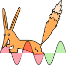
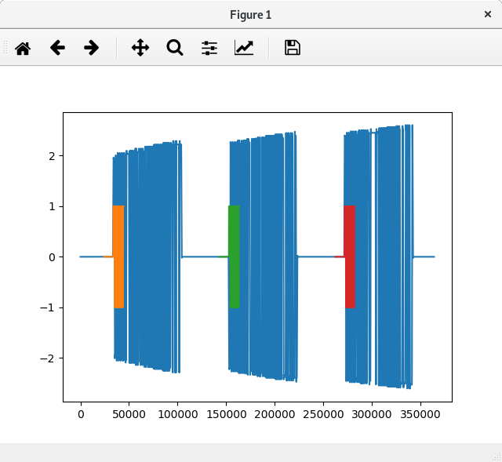
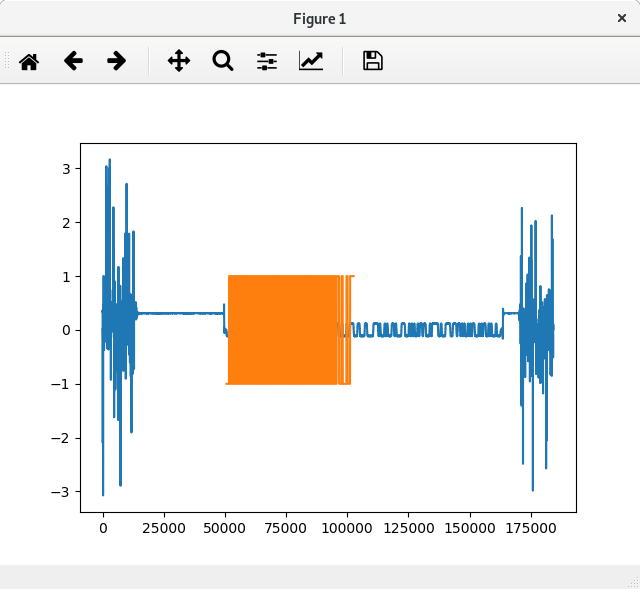

# `renard-phy` - Sigfox Protocol Physical Layer



`renard-phy` is an open source physical layer implementation of the Sigfox protocol's uplink and downlink written in Python for use with software defined radios (SDRs).
It supports demodulating received Sigfox uplinks and downlinks recorded as WAV files (e.g. with [gqrx](http://gqrx.dk/) and any SDR hardware that supports Sigfox's frequency range).
Modulating uplink and downlink frames is supported for the [*HackRF One*](https://greatscottgadgets.com/hackrf/) SDR.

`renard-phy` is built on top of [`renard`](https://github.com/Jeija/renard), the CLI interface to the open source Sigfox protocol library [`librenard`](https://github.com/Jeija/librenard).

`renard-phy` has only been tested in regulatory zone "RCZ1" (Europe / ETSI).

## Install / Dependencies
* `renard-phy` requires `renard` as a git submodule, so make sure to clone this repository recursively:
```
git clone --recursive https://github.com/Jeija/renard-phy
```
* Compile `renard` (see also [`renard`'s README](https://github.com/Jeija/renard))
```
cd renard
make
cd ..
```
* Install `renard-phy`'s dependencies: [NumPy](https://www.numpy.org/), [SciPy](https://www.scipy.org/), [Scapy](https://scapy.net/) and [matplotlib](https://matplotlib.org/). If you wish to transmit frames with the *HackRF One*, make sure to install the [HackRF drivers](https://github.com/mossmann/hackrf) so that `/usr/bin/hackrf_transfer` exists.

## Usage
### Sample Recordings
If you want to try out `renard-phy`, but don't have recordings of Sigfox uplinks / downlinks, you can download [sample WAV files](https://github.com/Jeija/renard-phy/releases/tag/recordings-release).

### Demodulation
#### Uplink
* Demodulate, do not decode:
```
$ cd renard-phy
$ ./uplink/demodulate.py uplink_4byte_zeros.wav
Estimating Frequency using 4096-length FFT
Signal Frequency: 2707.03 Hz
Mixing to Baseband with Costas Loop...
Low-pass Filtering...
Normalizing...
Finding Preamble(s)...
Found 3 Preambles!
[Frame 0]: Determining Frame Type...
[Frame 0]: Frame Type is 0x35f, Packet Length 12 bits
[Frame 0]: Content: 35f0088db334d000000000089b9c3e7
[Frame 0]: Decoding with renard:
[Frame 1]: Determining Frame Type...
[Frame 1]: Frame Type is 0x598, Packet Length 12 bits
[Frame 1]: Content: 59800ee806638c000000000ef0b52ed
[Frame 1]: Decoding with renard:
[Frame 2]: Determining Frame Type...
[Frame 2]: Frame Type is 0x5a3, Packet Length 12 bits
[Frame 2]: Content: 5a300aaedff9e4000000000abd7b31e
[Frame 2]: Decoding with renard:
```

* Demodulate and plot baseband signal, mark preambles:
```
$ ./uplink/demodulate.py uplink_4byte_zeros.wav --plot
```

<p align="center">
    
</p>

* Demodulate and decode frame contents with `renard` (you can also do this manually by copy-pasting the frame content output):
```
$ ./uplink/demodulate.py uplink_4byte_zeros.wav --decode
```

#### Downlink
* Demodulate, do not decode:
```
$ ./downlink/demodulate.py downlink_0000000000000000.wav
```

* Demodulate and plot baseband signal, mark preamble:
```
$ ./downlink/demodulate.py downlink_0000000000000000.wav --plot
```
<p align="center">
    
</p>

* Demodulate and brute-force-decode (other decoding options are available by manually copy-pasting the frame output for use with `renard`):
```
$ ./downlink/demodulate.py downlink_0000000000000000.wav --decode
```

### Modulation and Transmission with *HackRF One*
The content (payload / device ID / SN / ...) of the transmitted frames is generated by `renard`. Command line arguments to the `modulate_hackrf.py` scripts are passed to renard, so see [`renard`'s documentation](https://github.com/Jeija/renard) for a more extensive overview of possible command line options.

#### Uplink
* Transmit uplink with payload `0xabad1dea`. Mind that all command line options to `./uplink/modulate_hackrf.py` are simply forwarded to `renard ulencode` and `renard`'s raw frame output is then converted to raw signals for transmission with the *HackRF One*.
```
$ ./uplink/modulate_hackrf.py -p abad1dea -s 1a0 -i 004d33db -k 479e4480fd7596d45b0122fd282db3cf
```

* You can also transmit uplinks with arbitrary frame contents using `./uplink/modulate_hackrf_hex.py` by providing the binary frame content as hexadecimal string:
```
$ ./uplink/modulate_hackrf_hex.py aaaaa35f0001db334d00deadbeef68a60055
```

* You can even transmit multiple uplinks at different frequencies at the same time (frequency multiplexing) by providing all their hexadecimal frame contents to `./uplink/modulate_hackrf_hex_multiplex.py`. The script will output a command that can be used to transmit the generated *HackRF One* sample file:
```
$ ./uplink/modulate_hackrf_hex_multiplex.py aaaaa35f0001db334d00deadbeef68a60055 aaaaa35f0002db334d00abad1dea7c74c0e0
```

#### Downlink
* Transmit downlink with payload `0xdeadbeef02468ace`. The first parameter to `./downlink/modulate_hackrf.py` is the frequency of the *uplink that requested the downlink* in Hz. This value is used to calculate the appropriate downlink frequency that the frame is transmitted at. All further command line options are simply forwareded to `renard dlencode`.
```
$ ./downlink/modulate_hackrf.py 868100000 -p deadbeef02468ace -i 004d33db -k 479e4480fd7596d45b0122fd282db3cf -s 1a1
```
